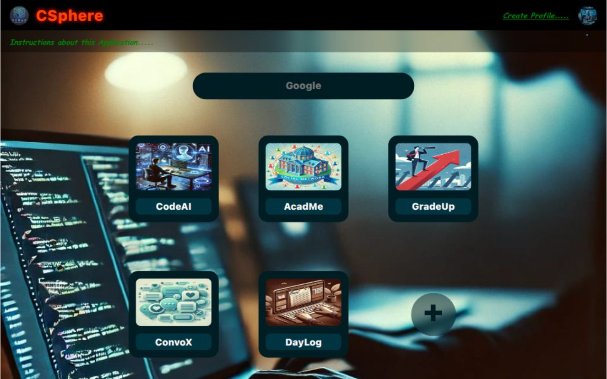

<h1 align="center" style="color:#2c3e50;">🧠 CSphere</h1>

<p align="center">
  
</p>

<p align="center">
  <b>An all-in-one learning platform tailored for beginner Computer Science students.</b><br>
  Offers curated programming courses, AI coding assistant, social interaction, and internship discovery.
</p>

---

## 📄 About the Project

**CSphere** is a comprehensive educational and networking platform built to support students beginning their Computer Science journey.  
It combines essential learning modules with community features, aiming to streamline the transition from learning to earning.

---

## 🌟 Features

- 📚 **Curated Programming Courses**  
  Learn C, C++, Java, Python, Web Development, and more — all in one place.

- 🤖 **AI-Powered Coding Assistant**  
  Get real-time code suggestions and debugging help from an AI-based support system.

- 🗨️ **Social Networking for Developers**  
  Connect, chat, and share updates with peers, mentors, and industry experts.

- 🧳 **Internship Discovery Portal**  
  Explore curated internship opportunities, apply directly, and track your progress.

- 📝 **Personal Notes & Diary**  
  Document your learning journey with daily notes and reflections.
---

## 🛠️ Tech Stack

> This repository contains the **full-stack application**.

- ⚛️ **Frontend:** React + Vite  
- 🎨 **Styling:** Tailwind CSS  
- 🧠 **AI Module:** Custom CodeAI support  
- 🌐 **Backend:** Node.js + Express.js  
- 🗃️ **Database:** MongoDB  
- 🔒 **Authentication:** Session-based with reCAPTCHA and OAuth

---

## 🚀 Live Demo

🌐 **App Link (Coming Soon):**  
[🔗 CSphere] https://c-sphere-jade.vercel.app/ *(under development)*

---

## 📁 Project Structure
```bash
csphere/
├── client/                  # React + Vite Frontend
│ ├── src/
│ │ ├── components/
│ │ ├── pages/
│ │ ├── services/
│ │ ├── assets/
│ └── index.html
├── server/                  # Express Backend
│ ├── routes/
│ ├── controllers/
│ ├── models/
│ └── index.js
├── .env.example
├── package.json
```
⚙️ Getting Started
1️⃣ Clone the Repository
bash
Copy
Edit
git clone https://github.com/rockyhans/CSphere
bash
Copy
Edit
cd csphere
2️⃣ Setup Environment Variables
Create a .env file from .env.example and configure your MongoDB URI, session secrets, API keys, etc.

3️⃣ Install Dependencies
# For backend
cd server
npm install

# For frontend
cd ../client
npm install
App will be running at:
Frontend → http://localhost:3000
Backend → http://localhost:5000

📅 Project Status
This project is currently ongoing and actively under development.
New features will be released regularly, including enhanced AI tools, user dashboards, and internship matching algorithms.

Stay tuned for updates!

👤 Contributors
<table> <tr> <td align="center">  <br /><sub><b>Danish Rizwan</b></sub><br /> <sub>Full-Stack Developer</sub> </td> </tr> </table>
📬 Contact
📧 Email: rdanishrizwan@example.com
💼 Team: CSphere Dev Core

